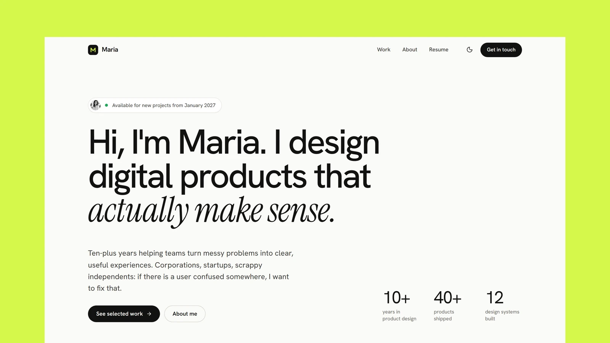

# Maria - Astro Portfolio Theme for Product Designers

[](https://maria.xocoweb.workers.dev/)

[](https://astro.build/)
[](https://tailwindcss.com/)
[](https://www.typescriptlang.org/)
[](./LICENSE)

**Live preview:** https://maria.xocoweb.workers.dev/

Maria is a free Astro theme for UX designers, product designers, and anyone whose portfolio is built on case studies. It pairs a calm, editorial layout with large type, a serif accent, and project cards framed in soft color, so the work stays the focus. Case studies are MDX files validated by Astro content collections, the copy lives in a few config files, and the output is fully static.

## Features

- A homepage with an availability badge, a large headline with a serif accent, key facts, selected case studies, services, and testimonials
- Case studies written in MDX, one folder per project with its images beside it, validated by a content schema
- Case study pages with a project summary, client, year, role, duration, team, and services, a full-width cover, and a "Next case study" card
- `Figure` and `Stats` components for framed screenshots with captions and outcome metrics, available in every case study without imports
- Project cards tinted per project, with a cropped cover and a quiet hover zoom
- A paginated work index with previous and next links
- An About page with a portrait, editorial sections, and principles
- A Resume page with a snapshot, experience, capabilities, education, tools, and an optional PDF download
- A closing "Let's talk" panel above the footer on every page, with a direct email button
- Privacy, Terms, and Cookie Policy pages written in MDX, and a designed 404 page
- A cookie consent banner and preferences dialog with analytics and marketing categories, a small client API, and a change event
- Light and dark modes that follow the system until a visitor picks one, applied before first paint
- A sticky header, a full-screen mobile menu built on the native dialog element, and a skip link
- Entrance and scroll-reveal motion in CSS only, switched off for reduced-motion users
- Responsive, optimized images through Astro's image pipeline, with social cards cropped from each case study's cover
- Canonical URLs, Open Graph and Twitter/X cards, sitemap, `robots.txt`, and JSON-LD for the site, profile pages, case studies, and breadcrumbs
- Self-hosted Hanken Grotesk and Instrument Serif, a local Lucide icon set, and design tokens in one stylesheet
- Static output with no framework islands and only a few small scripts
- Landmarks, labelled controls, visible focus states, and keyboard support throughout

## Tech Stack

- Astro 7 with MDX
- Tailwind CSS 4 via the Vite plugin
- TypeScript, Astro content collections
- `@astrojs/sitemap`, Sharp
- Self-hosted Hanken Grotesk and Instrument Serif, Lucide and Bootstrap Icons, each with its license notice

## Requirements

- Node.js `22.12.0` or newer
- npm

## Getting Started

```bash
npm install
npm run dev
```

Build for production:

```bash
npm run build
```

Preview the production build locally:

```bash
npm run preview
```

Before shipping a change, run type checking, the production build, and the formatter check together:

```bash
npm run release:check
```

## Customization

See [CUSTOMIZATION.md](./CUSTOMIZATION.md) for site settings, the homepage, case studies and their frontmatter, the MDX components, the About and Resume pages, legal pages, cookie consent, the theme's design tokens, fonts, icons, and dark mode.

Set `siteConfig.siteUrl` in [src/config/site.ts](./src/config/site.ts) before building — canonical URLs, social images, the sitemap, `robots.txt`, and the structured data are all derived from it. The build is static, so any host that serves a directory works: `vercel.json` is included for Vercel and `wrangler.jsonc` for Cloudflare Workers, and Netlify, GitHub Pages, and object storage behind a CDN need no configuration beyond `npm run build`.

## Content

Case studies live in [src/content/work](./src/content/work), one folder per project holding an `index.mdx` and its images, validated by the schema in [src/content.config.ts](./src/content.config.ts). The folder name is the case study's URL slug.

The bundled projects, people, and product screenshots are fictional demo content. Replace them with your own work, words, and portrait before launch.

## Support

Maria is free and provided as-is. Bug reports and questions are welcome as [GitHub issues](https://github.com/xocothemes/maria/issues); custom design and feature work is not included. See [CONTRIBUTING.md](./CONTRIBUTING.md) to propose a change, and [CHANGELOG.md](./CHANGELOG.md) for release history.

## License

MIT — free for personal and commercial projects. See [LICENSE](./LICENSE), which also lists the licenses of the bundled fonts and icons.

## Credits

- [Hanken Grotesk](https://github.com/marcologous/hanken-grotesk) by Alfredo Marco Pradil, under the SIL Open Font License
- [Instrument Serif](https://github.com/Instrument/instrument-serif) by Instrument, under the SIL Open Font License
- [Lucide](https://lucide.dev/), under the ISC License
- [Bootstrap Icons](https://icons.getbootstrap.com/), under the MIT License
